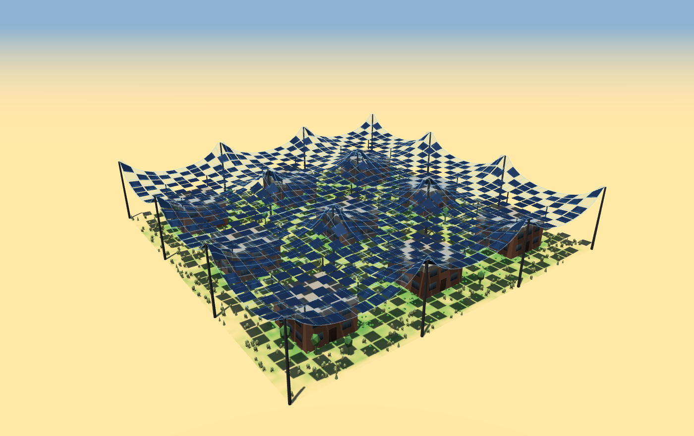
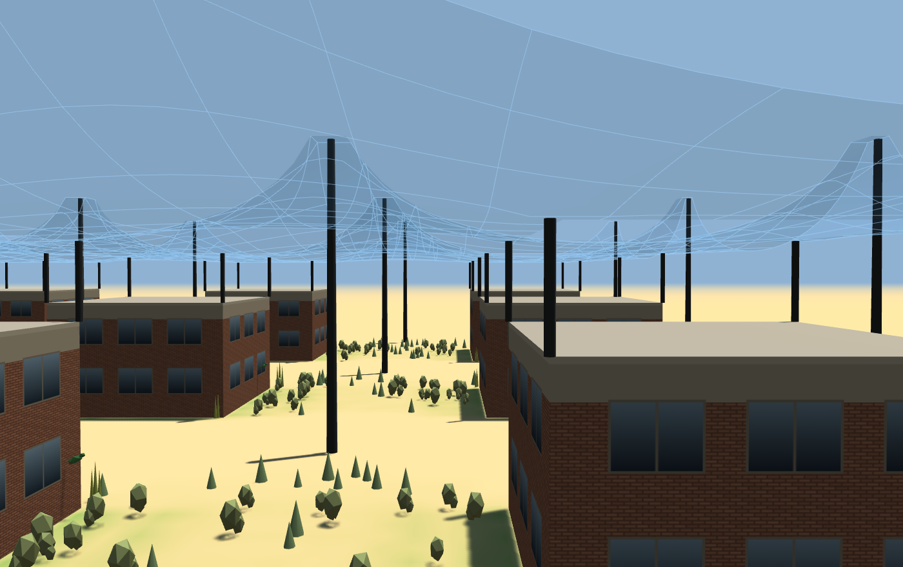
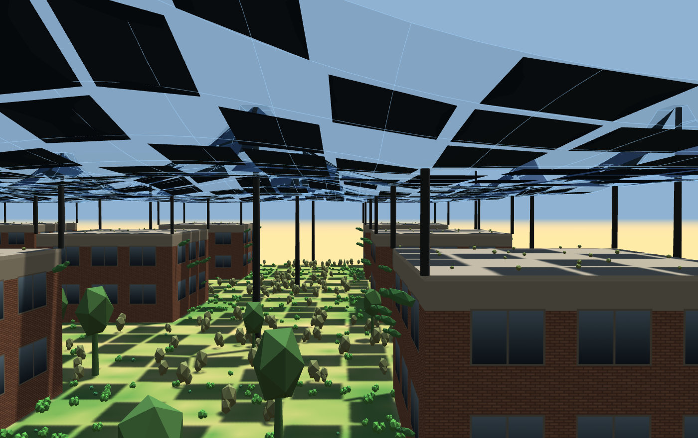
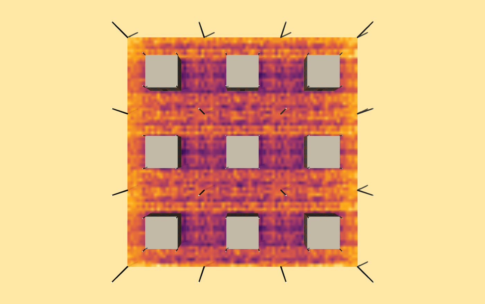
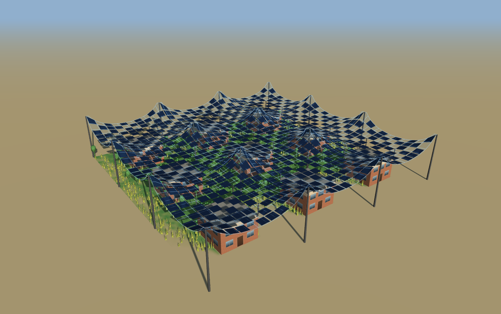
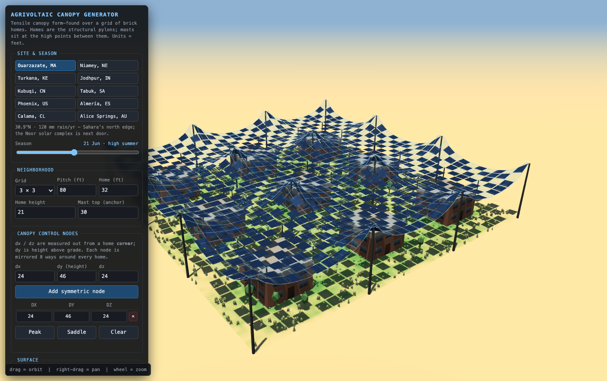

# Dappled Canopy

**[Run it in your browser →](https://williamsharkey.github.io/canopy/)**

A sketch tool for a question I wanted to get a feel for: **can you make a piece of
desert habitable by roofing it in a dappled solar canopy?**



Everything below is computed live in one HTML file. There is no build step, no server
and no account. Drag a slider and watch what the ground does.

## The idea I'm testing

Deserts are not short of energy. They are short of *shade*, and therefore short of
water, because bare ground at 45 °C loses whatever falls on it before anything can use
it. The usual response is to shade the ground with solar panels, which works, and then
you have a field of panels — an industrial site with nothing living in it and nowhere
for anyone to be.

So: what if the shade structure were a neighbourhood instead?

A grid of small brick homes acts as the structural pylons. Between them a prestressed
tensile membrane is stretched — a cable net, form-found, anchored to the corner tubing
of every house and lifted on masts between them. Solar modules hang from that membrane,
but only *some* of them, scattered in an even dither so what falls on the ground is
dappled shade rather than a hard roof. Partial coverage. Somewhere between a shade
cloth and an orchard.

The claim I wanted to check is that this has a **sweet spot**. Full sun and nothing
grows. Full coverage and nothing grows either, plus you have built a warehouse. In
between, there should be a band where you have cut the evaporative load enough for
plants to hold on, while still passing enough light for them to photosynthesise — and
you are generating power the whole time.

The tool exists to see whether that band is real, how wide it is, and what it looks
like to stand in.

## What it shows

Same camera, same neighbourhood, same day. The only thing that changed is module
coverage: 0% on the left, 50% on the right.

| Bare desert, no canopy | Under 50% dappled coverage |
|---|---|
|  |  |

The ground colour is not decoration — it is computed. Every cell gets a full day of
simulated sun, a water balance, and a verdict on how much ground cover that supports.
Then whatever will actually grow there is planted on it: cactus and agave in the open,
saltbush and sorghum in the half-shade, leaf crops in the deep shade, sedum on the
roofs, vines on the walls.

Sweeping coverage at Ouarzazate on 21 June:

| module coverage | 0% | 20% | 35% | 50% | 65% | 80% |
|---|---|---|---|---|---|---|
| sun reaching the ground | 90% | 76% | 65% | 54% | 44% | 33% |
| **ground in cover** | **5%** | **24%** | **44%** | **72%** | **84%** | **86%** |

So the band is real, and it is wide. Most of the gain has happened by 50% coverage,
which is also where you are still generating about half a megawatt off a 240 ft block.

## The sun map

Underneath the pretty part, the tool integrates the whole day's sun sweep across the
site and reports what each square foot of ground, roof and wall actually receives.



That is one day of light, canopy and modules hidden so you can see only what landed.
Bright is sun, dark is shade. Note that it bands **east–west**: the sun's daily travel
smears each module's shadow along that axis, so variation across the street averages
out while variation along it does not. You cannot see that by looking at a single
moment — it only appears once you integrate the day.

Some things I found by building it:

- **The average is almost fixed.** Over a whole day, a periodic array shades close to
  the same total area no matter what the sun does — the pattern slides, the area does
  not. Ground sun sits near 56% of open sky at every site and season at 50% coverage.
  What the design actually moves is the *spread*, not the mean.
- **Latitude changes the texture, not the total.** At 40°N in midwinter the sun rakes
  in at 26° and the site goes strongly contrasty — some ground in permanent shadow,
  some getting full sun sideways under the canopy edge.
- **The homes matter more than you would think.** Each one catches its own roof rain
  and concentrates it into a band at its feet, which is the greenest ground on the
  site. The buildings are not just pylons; they are water infrastructure.

## Ten places

You can drop the block on any of ten arid places where something like this is either
being built or seriously proposed — Ouarzazate, Niamey, Turkana, Jodhpur, Kubuqi,
Tabuk, Phoenix, Almería, Calama, Alice Springs. Latitude sets the sun path, annual
rainfall sets the water budget, and a season slider runs the year. Two of the ten are
in the southern hemisphere, so their seasons run backwards, which is a good check that
the solar geometry is real and not a hand-drawn arc.



Kubuqi at 40°N on 21 December: nine hours of daylight and a noon sun only 26° up.

## Using it



- **Site & season** — where on Earth, and when.
- **Neighborhood** — grid size, spacing, house size and height, anchor height.
- **Canopy control nodes** — add a point as `dx / dy / dz` out from a house corner. It
  gets mirrored eight ways around *every* house, so one entry defines the whole field.
  **Peak** and **Saddle** are worked examples.
- **Surface** — set *form-finding relaxation* to 0 to see the faceted plateau the shape
  starts as, then turn it up and watch it relax into a minimal surface. That is the
  soap-film shape a prestressed membrane actually takes, and it is the single most
  interesting slider in the tool.
- **Solar / shade** — coverage, module size, hour of day. **Run the day** sweeps the
  hour in real time, an hour every fifteen seconds.
- **Sun map & growth** — the heat map, the ground tint, the planting, and an irrigation
  slider for how much water you are prepared to put in.

Drag to orbit, right-drag to pan, wheel to zoom. Export `.obj` of the membrane and
modules, or `.json` of the whole design.

Everything is in **feet**.

## What this is not

I want to be straight about the modelling, because it looks more authoritative than it
is.

- **Clear sky only.** Haurwitz clear-sky irradiance with an 85/15 beam–diffuse split.
  No clouds, no aerosol, no terrain, no horizon shading. Solar time, with no longitude
  or equation-of-time correction.
- **The water model is an index, not hydrology.** Rainfall and an irrigation slider set
  the supply, sun burns it off, roofs concentrate their catchment near the walls. There
  is no soil, no infiltration, no runoff routing, no groundwater.
- **The planting is illustrative.** Species are picked by how well a patch fits a light
  and water range. Those ranges are plausible, not sourced from agronomy trials, and
  the plants are low-poly proxies rather than any particular cultivar.
- **No structural engineering.** The membrane is form-found for shape, which is real,
  but nothing here sizes a cable, checks a wind load, or asks whether a brick house
  wants a canopy pulling sideways on its corner.
- **No costs, no thermal model, no people.**

Treat the numbers as a way of comparing one configuration against another, not as a
feasibility study. The thing it is genuinely good for is *feel*: change something, see
the ground respond.

## Running it locally

Open `index.html`. That is the whole install. Libraries load from CDN with pinned local
copies in `vendor/` as an offline fallback, so it works with no network too.

There is a Playwright suite — 73 checks over the form-finding maths, every control,
malformed input, the solar model, the sun map, the throttling and both exports.

```
npm install
npx playwright install chromium
cd test
node suite.cjs                        # 73 checks
node render.cjs ../index.html /tmp/x  # overview, plan, street
node shots.cjs ../media               # regenerate the README images
```

The suite checks the solar model against numbers that do not come from this code — 12
hour days at the equator, opposite hemispheres, the sun rising in the east — because a
sun model that is self-consistently wrong is the easiest thing in the world to write.
It found exactly that, once: an early version had the sun rising in the west and
nothing looked wrong until latitude had to mean something.

## How it works, briefly

**Form finding.** Control points are mirrored eight ways around every house,
Delaunay-triangulated in plan, and rasterised onto a regular grid. Then every unpinned
node relaxes toward the mean of its neighbours, which converges on a minimal surface —
the shape an evenly prestressed membrane finds. The sag slider adds uniform self
weight, expressed as a sag depth over one clear span so it is independent of mesh
resolution and site size.

**Insolation.** A shadow map done in software, in plan. For each of ~21 sun positions
across the day, every occluder above roof height is projected down the sun vector onto
the ground and rasterised into a transmission mask. A point at height *h* then reads
that same mask at `(x − h·sx, z − h·sz)`, because dropping the ray from that point to
the ground shifts it by exactly that — so one mask serves the ground, the roofs and the
walls at once. Cost is O(modules × steps), about 10 ms for a 3×3 block, which is what
makes it cheap enough to redo on every parameter change.

**Throttling.** The first change after a pause runs a low-resolution draft immediately;
the full pass waits until the input settles. Work in flight is abandoned. The job is a
generator pumped about 6 ms per frame from the render loop, so it never blocks a frame.

## A fork

**[canopy-siege](https://github.com/williamsharkey/canopy-siege)**
([watch it](https://williamsharkey.github.io/canopy-siege/)) keeps all of this running
and puts people in the town, then sends machines after them. Same array, same
insolation model — except there the power budget also has to cover the lasers.

## Licence

MIT — see `LICENSE`. `vendor/` contains [three.js](https://threejs.org),
OrbitControls and [Delaunator](https://github.com/mapbox/delaunator), each under its
own MIT licence.
